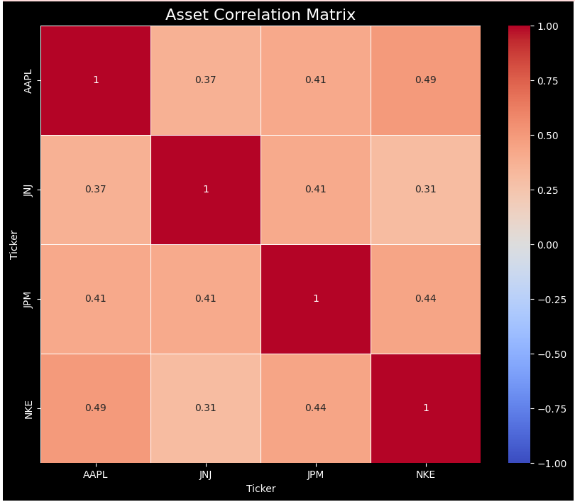
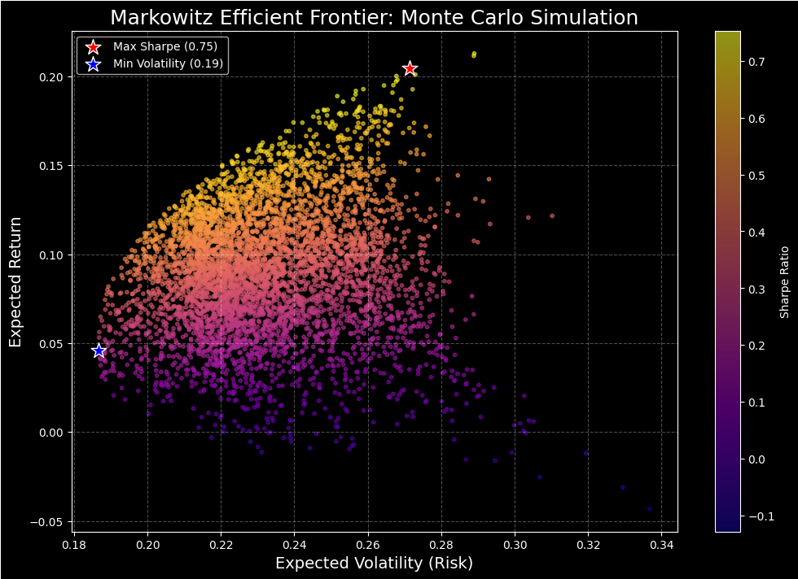
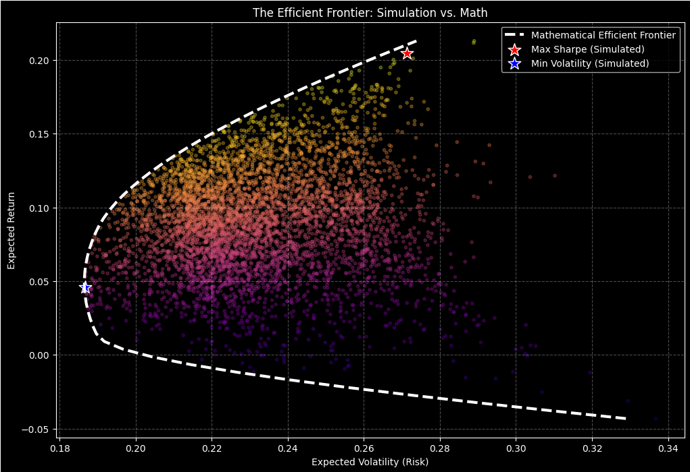
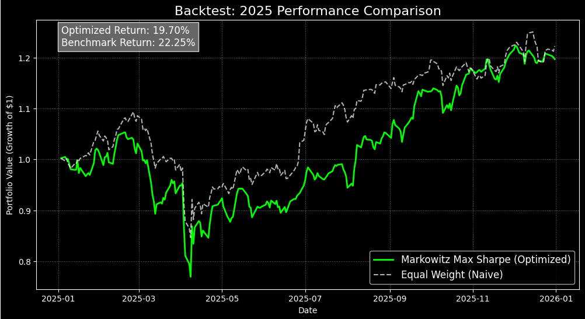

# 📈 Markowitz Portfolio Optimization & Backtesting Engine

### M.Tech Data Science Project | Quantitative Finance

This project implements **Modern Portfolio Theory (MPT)** from scratch in Python. It builds a complete pipeline to download financial data, simulate thousands of portfolio combinations, mathematically solve for the **Efficient Frontier**, and rigorously **backtest** the results against a naive benchmark.

The goal was not just to build the model, but to stress-test its assumptions and understand why theoretical optimization often fails in live markets.

---

## 🧠 1. The Theory: Modern Portfolio Theory
The Markowitz Model (1952) fundamentally changed finance by quantifying "Diversification."
* **Core Idea:** An asset's risk should not be measured in isolation, but by its contribution to the portfolio's overall variance.
* **The Math:** By combining assets with low or negative correlations, we can reduce total risk (volatility) without sacrificing expected returns.
* **The Goal:** Find the "Efficient Frontier"—the set of portfolios that offer the highest return for a given level of risk.

---

## 📊 2. Project Walkthrough

### Step 1: Data Analysis & Correlation
Before optimization, we analyze the relationships between assets. The model relies on the **Covariance Matrix** to find diversification benefits.


* **Inference:** The heatmap acts as a "Diversification Check." Dark red squares (Correlation $\approx$ 1.0) imply assets move together. We look for lighter squares (lower correlation), which provide the mathematical "hedge" that lowers portfolio risk.

### Step 2: The Monte Carlo Simulation
Instead of solving the equation immediately, we use a "Brute Force" approach, generating 5,000 random portfolios to visualize the trade-off between Risk and Return.


* **The "Cloud":** Represents the universe of possible portfolios.
* **The Sharpe Ratio:** The color gradient represents the Risk-Adjusted Return.
* **The Stars:**
    * 🔴 **Red Star (Max Sharpe):** The portfolio with the best "Bang for your Buck."
    * 🔵 **Blue Star (Min Volatility):** The "Safest" possible portfolio.

### Step 3: Mathematical Optimization (SLSQP)
We move from "guessing" to "solving" using **Convex Optimization** (`scipy.optimize`). We minimize portfolio variance for a range of target returns to draw the exact Efficient Frontier.


* **The White Dashed Line:** This is the theoretical limit. Notice how it traces the upper-left edge of our simulation cloud perfectly. It is mathematically impossible to find a portfolio *above* this line using these specific assets.

---

## 📉 3. The "Moment of Truth": Backtesting (2025)
A model is only as good as its predictive power. We trained the model on data from **2020–2024** and tested it on unseen data from **2025**.



### ⚠️ Critical Inference: The "Overfitting" Trap
* **Result:** The "Optimized" Markowitz portfolio (Green) **underperformed** the "Naive" Equal-Weight benchmark (White).
* **Why did it fail?**
    1.  **Regime Shift:** The correlations and volatility patterns of 2020–2024 did not persist in 2025. The model assumed the future would look like the past.
    2.  **Concentration Risk:** The optimizer likely allocated heavy weights to assets that performed well historically ("Estimation Error Maximization"). When those specific assets cooled off, the portfolio suffered.
    3.  **The Lesson:** This confirms that **Mean-Variance Optimization** is highly sensitive to input data. In production, this requires "Shrinkage Estimators" (e.g., Ledoit-Wolf) or "Black-Litterman" models to be robust.

---

## 🛠️ Tech Stack
* **Language:** Python 3.10+
* **Data Source:** `yfinance` (Yahoo Finance API)
* **Core Libraries:**
    * `numpy` & `pandas`: Data manipulation and log-return calculations.
    * `scipy.optimize`: SLSQP algorithm for convex optimization.
    * `matplotlib` & `seaborn`: Visualization.

## 🚀 How to Run
1.  Install dependencies:
    ```bash
    pip install yfinance numpy pandas matplotlib seaborn scipy
    ```
2.  Run the notebook/script to download fresh data and generate the report.

---

## 🔮 Future Improvements
To fix the underperformance seen in the backtest, the next iteration of this project will include:
* **Rolling Window Backtesting:** Rebalancing the portfolio monthly instead of holding fixed weights for a year.
* **Transaction Costs:** Incorporating fees to see if the "optimal" strategy is actually profitable.
* **Risk Parity:** An alternative weighting scheme that focuses on allocating risk rather than capital.
